# 🔁 Exercícios: Estruturas de Repetição (for)


Diretório reservado para a resolução de 7 exercícios de lógica usando a estrutura de repetição `for`, do curso **[C# COMPLETO Programação Orientada a Objetos + Projetos](https://www.udemy.com/course/programacao-orientada-a-objetos-csharp/)**, ministrado pelo professor **Nelio Alves** na plataforma **Udemy**.

📌 **Foco:** Estruturas de repetição com quantidade determinada de passos (laço `for`).  
📊 **Progresso:** 🚧 7/7 concluídos.

---

## 🛠️ Conhecimentos Desenvolvidos

* **A Lógica do Laço `for`:** Entender na prática como configurar o início, a condição de parada e o passo de uma repetição quando sabemos exatamente quantas vezes o código precisa rodar.
* **Contadores e Acumuladores:** O hábito de criar variáveis fora do laço para guardar resultados, seja para contar quantas vezes algo aconteceu (como um "placar") ou para ir somando/multiplicando valores a cada volta.
* **Conversão de Tipos (Casting):** O famoso `(double)`. Aprendi a forçar o C# a fazer contas quebradas com precisão, mesmo quando os números originais do cálculo são inteiros.
* **Interpolação de Strings:** Um jeito muito mais limpo e legível de misturar textos e variáveis na mesma linha usando o cifrão e chaves (`$"{variavel}"`).
* **Matemática Aplicada ao Código:** Traduzir problemas lógicos para a programação, calculando desde fatoriais e médias ponderadas até a validação de regras importantes (como não permitir divisão por zero).

---

## 📋 Resumo dos Exercícios

| # | Desafio | O que eu pratiquei |
|---|---|---|
| **01** | Ímpares | Usar o `for` junto com o resto da divisão (`%`) para filtrar números. |
| **02** | Dentro e Fora | Criar variáveis contadoras que atualizam seu valor a cada ciclo do laço. |
| **03** | Médias Ponderadas | Ler várias linhas de entrada e aplicar cálculos com pesos diferentes. |
| **04** | Divisão Pares | Tratar a divisão por zero e forçar o resultado decimal usando *casting*. |
| **05** | Fatorial | A lógica clássica de usar um acumulador multiplicando o valor a cada volta. |
| **06** | Divisores | Usar o operador de módulo (`%`) para descobrir divisões exatas. |
| **07** | Linhas, Quadrado e Cubo | Usar o próprio contador do laço (`i`) para fazer os cálculos na hora de imprimir. |

---

## 💻 Soluções e Códigos

*(Clique nos títulos abaixo para exibir o enunciado, o código-fonte e o resultado no terminal)*

---

<details>
<summary><strong>Exercício 01: Ímpares</strong></summary>

### 📷 Enunciado:
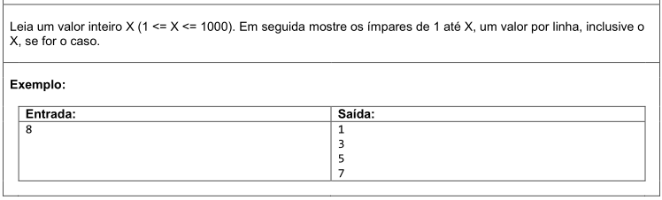

### 💻 Código:
```csharp
namespace OddNumbers {
    class Program {
        static void Main(string[] args) {

            int x = int.Parse(Console.ReadLine()!);

            for (int i = 1; i <= x; i++) {
                if (i % 2 != 0) {
                    Console.WriteLine(i);
                }
            }
        }
    }
}
```

### 🖥️ Saída no Terminal:
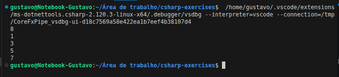

</details>

---

<details>
<summary><strong>Exercício 02: Dentro e Fora</strong></summary>

### 📷 Enunciado:
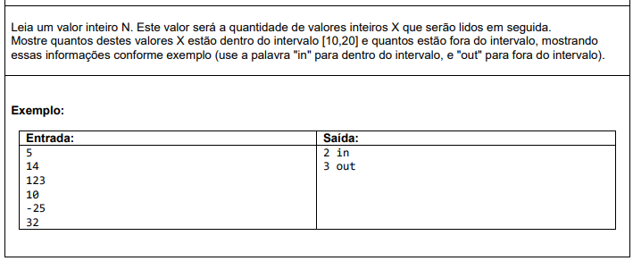

### 💻 Código:
```csharp
using System;

namespace insideOutside {
    class Program {
        static void Main(string[] args) {

            int n = int.Parse(Console.ReadLine()!);

            int cont_in = 0;
            int cont_out = 0;

            for (int i = 0; i < n; i++) {
                int x = int.Parse(Console.ReadLine()!);
                if (x >= 10 && x <= 20) {
                    cont_in = cont_in + 1;
                }
                else {
                    cont_out = cont_out + 1;
                }
            }

            Console.WriteLine(cont_in + " in");
            Console.WriteLine(cont_out + " out");
        }
    }
}
```

### 🖥️ Saída no Terminal:
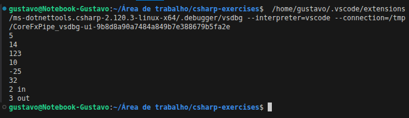

</details>

---

<details>
<summary><strong>Exercício 03: Médias Ponderadas</strong></summary>

### 📷 Enunciado:
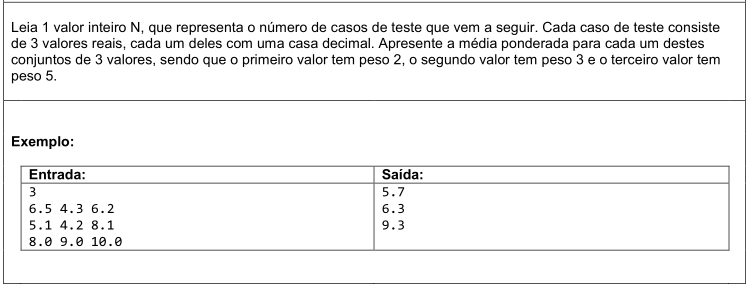

### 💻 Código:
```csharp
using System;
using System.Globalization;

namespace weightedAverages {
    class Program {
        static void Main(string[] args) {

            int n = int.Parse(Console.ReadLine()!);

            for (int i = 0; i < n; i++) {

                string[] line = Console.ReadLine()!.Split(' ');
                double a = double.Parse(line[0], CultureInfo.InvariantCulture);
                double b = double.Parse(line[1], CultureInfo.InvariantCulture);
                double c = double.Parse(line[2], CultureInfo.InvariantCulture);

                double media = (a * 2.0 + b * 3.0 + c * 5.0) / 10.0;

                Console.WriteLine(media.ToString("F1", CultureInfo.InvariantCulture));
            }
        }
    }
}
```

### 🖥️ Saída no Terminal:
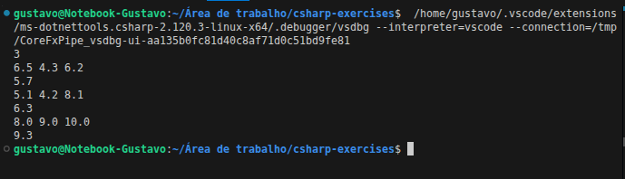

</details>

---

<details>
<summary><strong>Exercício 04: Divisão Pares</strong></summary>

### 📷 Enunciado:
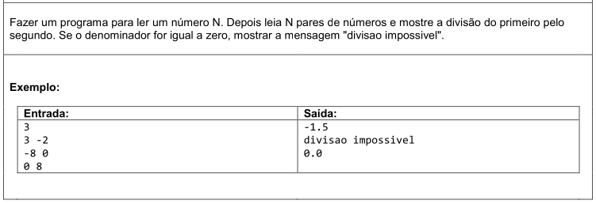

### 💻 Código:
```csharp
using System;
using System.Globalization;

namespace divisionPairs {
    class Program {
        static void Main(string[] args) {

            int n = int.Parse(Console.ReadLine()!);

            for (int i = 0; i < n; i++) {

                string[] line = Console.ReadLine()!.Split(' ');
                int x = int.Parse(line[0]);
                int y = int.Parse(line[1]);

                if (y == 0) {
                    Console.WriteLine("divisao impossivel");
                }
                else {
                    double div = (double)x / y;
                    Console.WriteLine(div.ToString("F1", CultureInfo.InvariantCulture));
                }
            }
        }
    }
}
```

### 🖥️ Saída no Terminal:
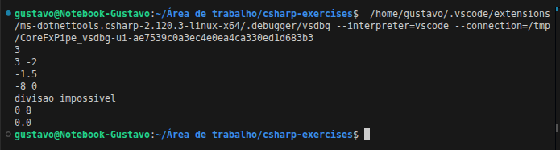

</details>

---

<details>
<summary><strong>Exercício 05: Fatorial</strong></summary>

### 📷 Enunciado:
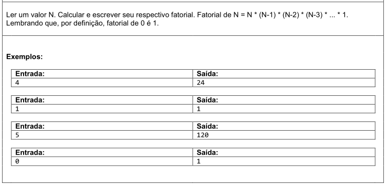

### 💻 Código:
```csharp
using System;

namespace factorial {
    class Program {
        static void Main(string[] args) {

            int n = int.Parse(Console.ReadLine()!);

            int fat = 1;
            for (int i = 1; i <= n; i++) {
                fat = fat * i;
            }

            Console.WriteLine(fat);
        }
    }
}
```

### 🖥️ Saída no Terminal:
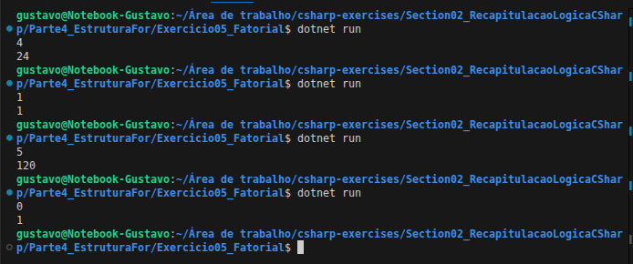

</details>

---

<details>
<summary><strong>Exercício 06: Divisores</strong></summary>

### 📷 Enunciado:
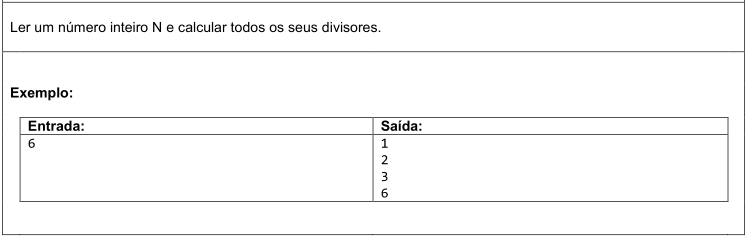

### 💻 Código:
```csharp
using System;

namespace dividers {
    class Program {
        static void Main(string[] args) {

            int n = int.Parse(Console.ReadLine()!);

            for (int i = 1; i <= n; i++) {
                if (n % i == 0) {
                    Console.WriteLine(i);
                }
            }
        }
    }
}
```

### 🖥️ Saída no Terminal:
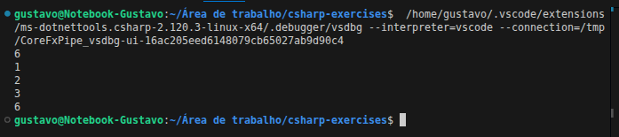

</details>

---

<details>
<summary><strong>Exercício 07: Linhas, Quadrado e Cubo</strong></summary>

### 📷 Enunciado:
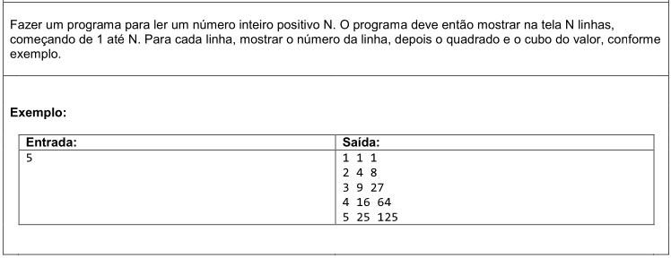

### 💻 Código:
```csharp
using System;

namespace linesSquareCube {
    class Program {
        static void Main(string[] args) {

            int n = int.Parse(Console.ReadLine()!);

            for (int i = 1; i <= n; i++) {

                int primeiro = i;
                int segundo = i * i;
                int terceiro = i * i * i;
                Console.WriteLine($"{primeiro} {segundo} {terceiro}");
            }
        }
    }
}
```

### 🖥️ Saída no Terminal:
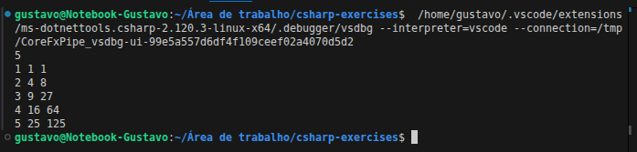

</details>

---