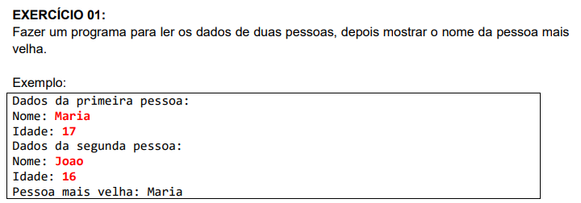
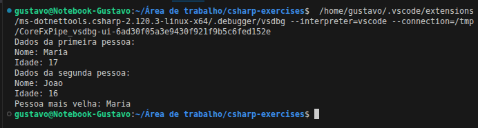
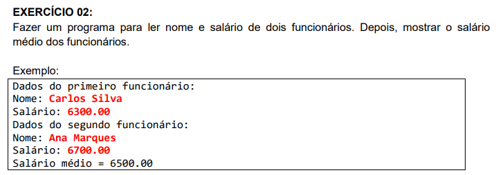
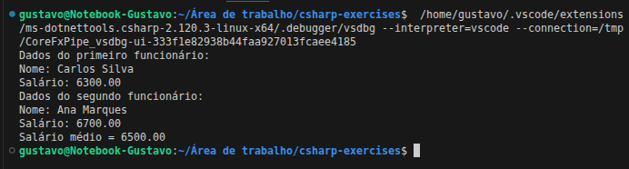
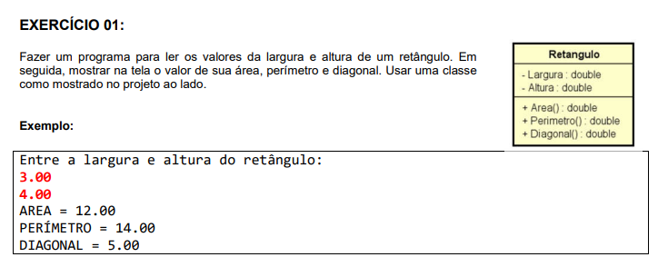
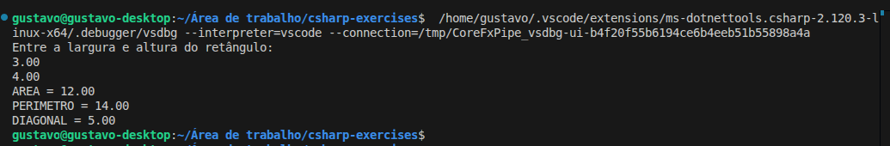
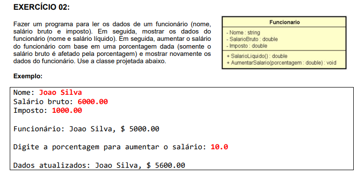
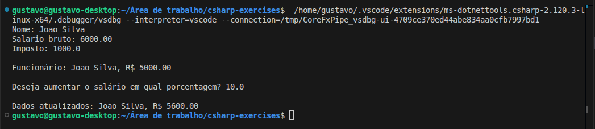
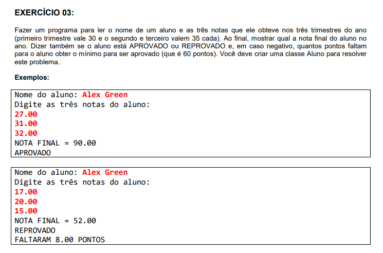
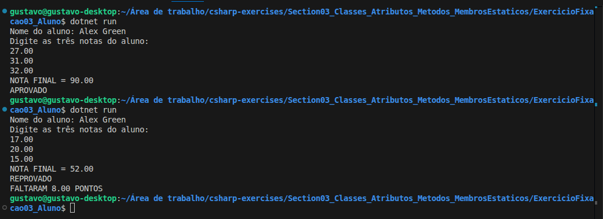

# 📦 Exercícios: Introdução à Programação Orientada a Objetos


Diretório reservado para a resolução de 5 exercícios práticos de introdução à POO do curso **[C# COMPLETO Programação Orientada a Objetos + Projetos](https://www.udemy.com/course/programacao-orientada-a-objetos-csharp/)**, ministrado pelo professor **Nelio Alves** na plataforma **Udemy**.

📌 **Foco:** O foco aqui foi dar os primeiros passos em POO — criar classes, instanciar objetos e parar de jogar tudo dentro do `Main`.
📊 **Progresso:** ✅ 5/5 concluídos.

---

## 🛠️ Conhecimentos Desenvolvidos

Esses exercícios marcaram minha primeira experiência real pensando em **objetos** em vez de
procedimentos. Algumas coisas que ficaram mais claras na prática:

- **Separar responsabilidades:** tirar a lógica do `Program.cs` e colocar numa classe própria
  fez o código ficar muito mais limpo e fácil de entender.
- **Instanciar objetos:** usar o `new` para criar instâncias distintas na memória — e perceber
  que cada uma guarda seu próprio estado — foi um clique importante.
- **Criar métodos com propósito:** em vez de calcular tudo no `Main`, passei a delegar para
  métodos como `Area()`, `SalarioLiquido()` e `Aprovado()`, cada um com uma responsabilidade clara.
- **`override ToString()`:** foi a primeira vez que sobrescrevi um método herdado. Pequeno, mas foi o primeiro contato real com o conceito de herança.

---

## 📋 Resumo dos Exercícios

| # | O que era pra fazer | O que eu pratiquei |
|---|---|---|
| **01** | Comparar a idade de duas pessoas | Criar dois objetos da mesma classe e comparar atributos |
| **02** | Calcular o salário médio de dois funcionários | Ler atributos mistos e operar com múltiplas instâncias |
| **Fix 01** | Calcular área, perímetro e diagonal de um retângulo | Métodos sem parâmetros e uso do `Math.Sqrt()` |
| **Fix 02** | Mostrar e atualizar salário de um funcionário | Métodos com parâmetros e `override ToString()` |
| **Fix 03** | Verificar aprovação de um aluno pelas notas | Método com retorno `bool` e lógica condicional dentro da classe |

---

## 💻 Soluções e Códigos

*(Clique nos títulos abaixo para exibir o enunciado, o código-fonte e o resultado no terminal)*

<details>
<summary><strong>Exercicío 01: Pessoa Mais Velha</strong></summary><br>

### 📷 Enunciado:


### 💻 Código:
```csharp
// Classe Pessoa:
namespace Exercicio01_PessoaMaisVelha {
    class Pessoa {
        public string Nome;
        public int Idade;
    }
}

// Classe Program:
using System;
namespace Exercicio01_PessoaMaisVelha
{
    class Program
    {
        static void Main(string[] args)
        {
            Pessoa p1 = new Pessoa();
            Pessoa p2 = new Pessoa();
            Console.WriteLine("Dados da primeira pessoa:");
            Console.Write("Nome: ");
            p1.Nome = Console.ReadLine()!;
            Console.Write("Idade: ");
            p1.Idade = int.Parse(Console.ReadLine()!);
            Console.WriteLine("Dados da segunda pessoa:");
            Console.Write("Nome: ");
            p2.Nome = Console.ReadLine()!;
            Console.Write("Idade: ");
            p2.Idade = int.Parse(Console.ReadLine()!);
            if (p1.Idade > p2.Idade)
            {
                Console.WriteLine("Pessoa mais velha: " + p1.Nome);
            }
            else
            {
                Console.WriteLine("Pessoa mais velha: " + p2.Nome);
            }
        }
    }
}
```

### 🖥️ Saída no Terminal:


</details>

---

<details>
<summary><strong>Exercicío 02: Salário Médio</strong></summary><br>

### 📷 Enunciado:


### 💻 Código:
```csharp
// Classe Funcionario:
namespace Exercicio02_SalarioMedio
{
    class Funcionario
    {
        public string Nome;
        public double Salario;
    }
}

// Classe Program:
using System;
using System.Globalization;
namespace Exercicio02_SalarioMedio
{
    class Program
    {
        static void Main(string[] args)
        {
            Funcionario f1 = new Funcionario();
            Funcionario f2 = new Funcionario();
            Console.WriteLine("Dados do primeiro funcionário:");
            Console.Write("Nome: ");
            f1.Nome = Console.ReadLine()!;
            Console.Write("Salário: ");
            f1.Salario = double.Parse(Console.ReadLine()!, CultureInfo.InvariantCulture);
            Console.WriteLine("Dados do segundo funcionário:");
            Console.Write("Nome: ");
            f2.Nome = Console.ReadLine()!;
            Console.Write("Salário: ");
            f2.Salario = double.Parse(Console.ReadLine()!, CultureInfo.InvariantCulture);
            double media = (f1.Salario + f2.Salario) / 2.0;
            Console.WriteLine("Salário médio = " + media.ToString("F2", CultureInfo.InvariantCulture));
        }
    }
}
```

### 🖥️ Saída no Terminal:


</details>

---

<details>
<summary><strong>Exercicío Fix 01: Retângulo </strong></summary><br>

### 📷 Enunciado:


### 💻 Código:
```csharp
// Classe Retangulo:
using System;
namespace ExercicioFixacao01_Retangulo
{
    class Retangulo
    {
        public double Largura;
        public double Altura;
        public double Area()
        {
            return Largura * Altura;
        }
        public double Perimetro()
        {
            return 2 * (Largura + Altura);
        }
        public double Diagonal()
        {
            return Math.Sqrt(Largura * Largura + Altura * Altura);
        }
    }
}

// Classe Program:
using System;
using System.Globalization;
namespace ExercicioFixacao01_Retangulo
{
    class Program
    {
        static void Main(string[] args)
        {
            Retangulo ret = new Retangulo();
            Console.WriteLine("Entre a largura e altura do retângulo: ");
            ret.Largura = double.Parse(Console.ReadLine(), CultureInfo.InvariantCulture);
            ret.Altura = double.Parse(Console.ReadLine(), CultureInfo.InvariantCulture);
            Console.WriteLine("AREA = " + ret.Area().ToString("F2", CultureInfo.InvariantCulture));
            Console.WriteLine("PERIMETRO = " + ret.Perimetro().ToString("F2", CultureInfo.InvariantCulture));
            Console.WriteLine("DIAGONAL = " + ret.Diagonal().ToString("F2", CultureInfo.InvariantCulture));
        }
    }
}
```

### 🖥️ Saída no Terminal:


</details>

---

<details>
<summary><strong>Exercicío Fix 02: Funcionário </strong></summary><br>

### 📷 Enunciado:


### 💻 Código:
```csharp
// Classe Funcionario:
using System.Globalization;
namespace ExercicioFixacao02_Funcionario
{
    class Funcionario
    {
        public string Nome;
        public double SalarioBruto;
        public double Imposto;
        public double SalarioLiquido()
        {
            return SalarioBruto - Imposto;
        }
        public void AumentarSalario(double porcentagem)
        {
            SalarioBruto = SalarioBruto + (SalarioBruto * porcentagem / 100.0);
        }
        public override string ToString()
        {
            return Nome
            + ", R$ "
            + SalarioLiquido().ToString("F2", CultureInfo.InvariantCulture);
        }
    }
}

// Classe Program:
using System;
using System.Globalization;
namespace ExercicioFixacao02_Funcionario
{
    class Program
    {
        static void Main(string[] args)
        {
            Funcionario func = new Funcionario();
            Console.Write("Nome: ");
            func.Nome = Console.ReadLine();
            Console.Write("Salario bruto: ");
            func.SalarioBruto = double.Parse(Console.ReadLine(), CultureInfo.InvariantCulture);
            Console.Write("Imposto: ");
            func.Imposto = double.Parse(Console.ReadLine(), CultureInfo.InvariantCulture);
            Console.WriteLine();
            Console.WriteLine("Funcionário: " + func);
            Console.WriteLine();
            Console.Write("Deseja aumentar o salário em qual porcentagem? ");
            double porcent = double.Parse(Console.ReadLine(), CultureInfo.InvariantCulture);
            func.AumentarSalario(porcent);
            Console.WriteLine();
            Console.WriteLine("Dados atualizados: " + func);
        }
    }
}
```

### 🖥️ Saída no Terminal:


</details>

---

<details>
<summary><strong>Exercicío Fix 03: Aluno </strong></summary><br>

### 📷 Enunciado:


### 💻 Código:
```csharp
// Classe Aluno:
namespace ExercicioFixacao03_Aluno
{
    class Aluno
    {
        public string Nome;
        public double Nota1, Nota2, Nota3;
        public double NotaFinal()
        {
            return Nota1 + Nota2 + Nota3;
        }
        public bool Aprovado()
        {
            if (NotaFinal() >= 60.0)
            {
                return true;
            }
            else
            {
                return false;
            }
        }
        public double NotaRestante()
        {
            if (Aprovado())
            {
                return 0.0;
            }
            else
            {
                return 60.0 - NotaFinal();
            }
        }
    }
}

// Classe Program:
using System;
using System.Globalization;
namespace ExercicioFixacao03_Aluno
{
    class Program
    {
        static void Main(string[] args)
        {
            Aluno aluno = new Aluno();
            Console.Write("Nome do aluno: ");
            aluno.Nome = Console.ReadLine();
            Console.WriteLine("Digite as três notas do aluno:");
            aluno.Nota1 = double.Parse(Console.ReadLine(), CultureInfo.InvariantCulture);
            aluno.Nota2 = double.Parse(Console.ReadLine(), CultureInfo.InvariantCulture);
            aluno.Nota3 = double.Parse(Console.ReadLine(), CultureInfo.InvariantCulture);
            Console.WriteLine("NOTA FINAL = "
            + aluno.NotaFinal().ToString("F2", CultureInfo.InvariantCulture));
            if (aluno.Aprovado())
            {
                Console.WriteLine("APROVADO");
            }
            else
            {
                Console.WriteLine("REPROVADO");
                Console.WriteLine("FALTARAM "
                + aluno.NotaRestante().ToString("F2", CultureInfo.InvariantCulture)
                + " PONTOS");
            }
        }
    }
}
```

### 🖥️ Saída no Terminal:


</details>

---