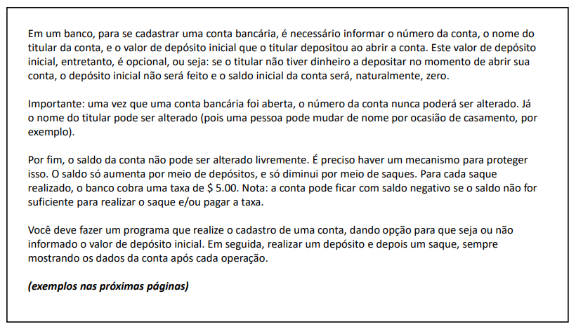
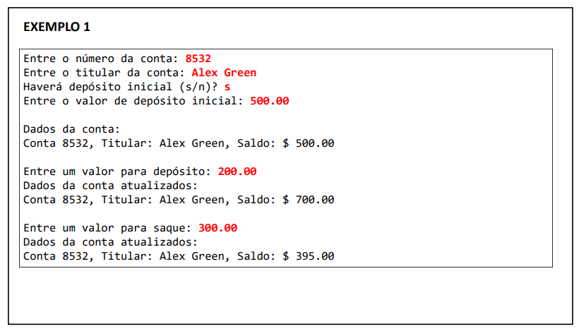
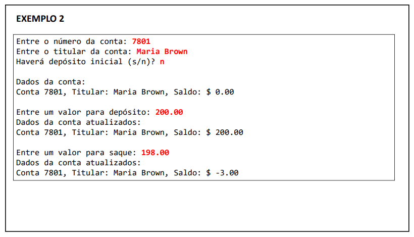
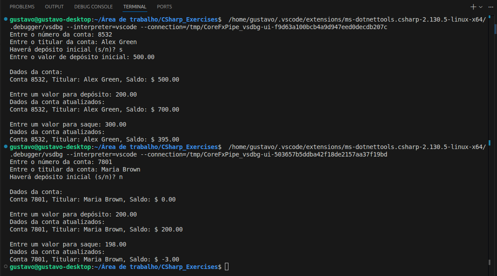

# Exercício: Construtores, Palavra `this`, Sobrecarga e Encapsulamento


Este diretório contém a resolução do exercício de fixação focado em proteger o estado dos objetos e refinar a criação de instâncias, do curso **[C# COMPLETO Programação Orientada a Objetos + Projetos](https://www.udemy.com/course/programacao-orientada-a-objetos-csharp/)**, ministrado pelo professor **Nelio Alves** na plataforma **Udemy**.

📌 **Foco:** Aprender a proteger dados sensíveis e garantir que um objeto seja criado de forma válida desde o primeiro segundo de vida na memória.
📊 **Progresso:** ✅ 1/1 concluído.

-----

## 🛠️ Conhecimentos Desenvolvidos

Nesta etapa, o foco saiu da "lógica de cálculo" e foi para a **segurança e estrutura** da classe. Os pontos principais foram:

  - **Encapsulamento com `private set`:** Entendi que nem todo dado deve ser alterado por qualquer um. O saldo da conta e o número da conta foram protegidos para que apenas a própria classe decida como eles mudam.
  - **Sobrecarga de Construtores:** Criei duas formas de iniciar uma conta — uma informando um depósito inicial e outra não — dando flexibilidade ao sistema.
  - **Palavra-chave `this`:** Utilizei para evitar repetição de código, fazendo um construtor chamar o outro.
  - **Centralização de Lógica:** No construtor com depósito inicial, chamei o método `Deposito()` em vez de alterar o saldo diretamente, garantindo que qualquer regra futura de depósito seja aplicada globalmente.

-----

## 📋 Resumo do Exercício

| \# | O que era pra fazer | O que eu pratiquei |
|---|---|---|
| **Fix 01** | Criar um sistema bancário com saque (com taxa) e depósito | Construtores, propriedades autoimplementadas e modificadores de acesso |

---

## 💻 Soluções e Códigos

*(Clique nos títulos abaixo para exibir o enunciado, o código-fonte e o resultado no terminal)*

<details>
<summary><strong>Exercicío Fix 01: Conta Bancária</strong></summary><br>

### 📷 Enunciado:




### 💻 Código:
```csharp
// Classe ContaBancaria:
using System.Globalization;

namespace Exercicio_Fixacao_ContaBancaria
{
    class ContaBancaria
    {
        public int Numero { get; private set; }
        public string Titular { get; set; }
        public double Saldo { get; private set; }

        public ContaBancaria(int numero, string titular)
        {
            Numero = numero;
            Titular = titular;
        }

        public ContaBancaria(int numero, string titular, double depositoInicial) : this(numero, titular)
        {
            Deposito(depositoInicial);
        }

        public void Deposito(double quantia)
        {
            Saldo += quantia;
        }

        public void Saque(double quantia)
        {
            Saldo -= (quantia + 5.0);
        }

        public override string ToString()
        {
            return "Conta "
                + Numero
                + ", Titular: "
                + Titular
                + ", Saldo: $ "
                + Saldo.ToString("F2", CultureInfo.InvariantCulture);
        }
    }
}

// Classe Program:
using System;
using System.Globalization;

namespace Exercicio_Fixacao_ContaBancaria
{
    class Program
    {
        static void Main(string[] args)
        {
            ContaBancaria conta;

            Console.Write("Entre o número da conta: ");
            int numero = int.Parse(Console.ReadLine()!);

            Console.Write("Entre o titular da conta: ");
            string titular = Console.ReadLine()!;

            Console.Write("Haverá depósito inicial (s/n)? ");
            char resp = char.Parse(Console.ReadLine()!);

            if (resp == 's' || resp == 'S')
            {
                Console.Write("Entre o valor de depósito inicial: ");
                double depositoInicial = double.Parse(Console.ReadLine()!, CultureInfo.InvariantCulture);
                conta = new ContaBancaria(numero, titular, depositoInicial);
            }
            else
            {
                conta = new ContaBancaria(numero, titular);
            }

            Console.WriteLine();
            Console.WriteLine("Dados da conta:");
            Console.WriteLine(conta);

            Console.WriteLine();
            Console.Write("Entre um valor para depósito: ");
            double quantia = double.Parse(Console.ReadLine()!, CultureInfo.InvariantCulture);
            conta.Deposito(quantia);
            Console.WriteLine("Dados da conta atualizados:");
            Console.WriteLine(conta);

            Console.WriteLine();
            Console.Write("Entre um valor para saque: ");
            quantia = double.Parse(Console.ReadLine()!, CultureInfo.InvariantCulture);
            conta.Saque(quantia);
            Console.WriteLine("Dados da conta atualizados:");
            Console.WriteLine(conta);
        }
    }
}
```

### 🖥️ Saída no Terminal:


</details>

---