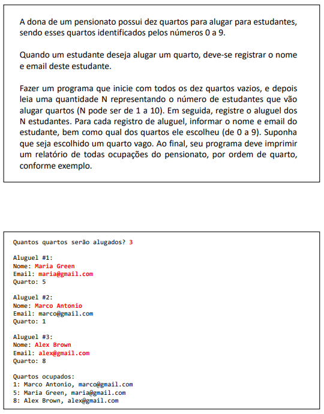
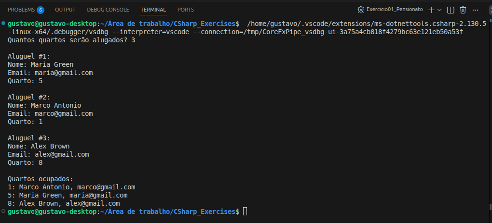
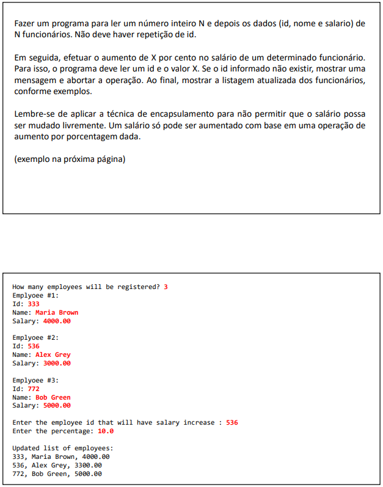
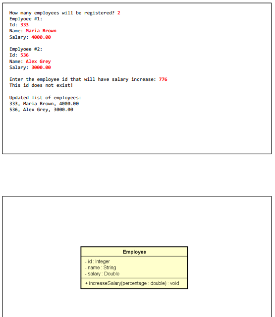
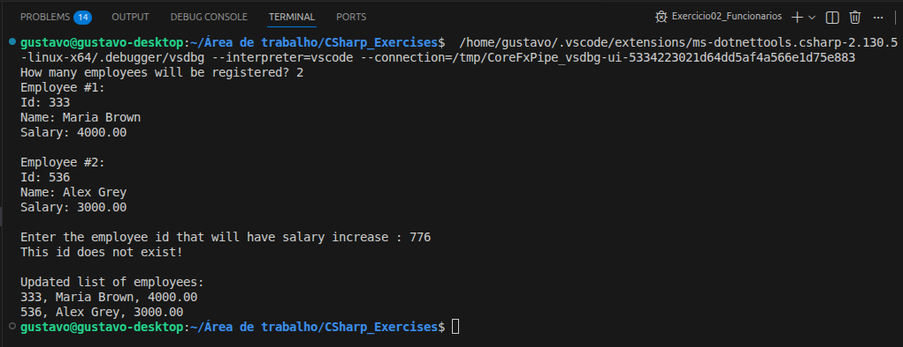
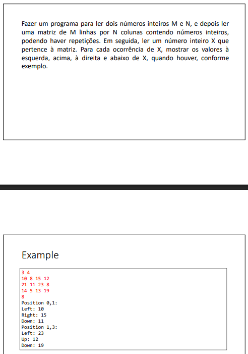
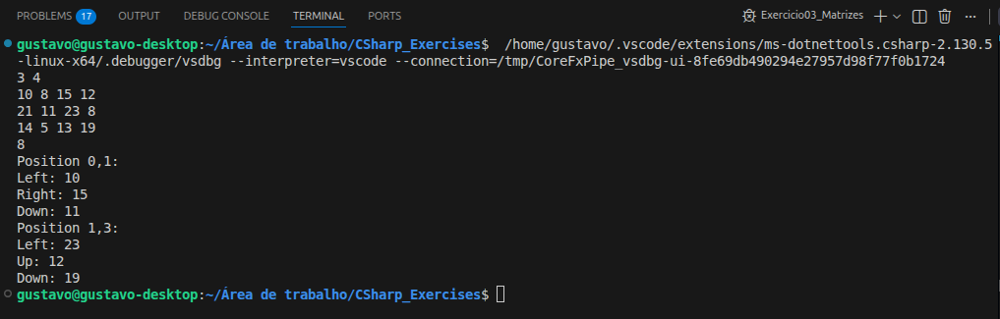

# Exercícios: Memória, Arrays e Listas


Este diretório reúne as resoluções dos exercícios de fixação sobre alocação de memória, vetores, matrizes e coleções, do curso **[C# COMPLETO Programação Orientada a Objetos + Projetos](https://www.udemy.com/course/programacao-orientada-a-objetos-csharp/)**, ministrado pelo professor **Nelio Alves** na plataforma **Udemy**.

📌 **Foco:** praticar o uso de estruturas de dados na memória, desde vetores e matrizes até listas dinâmicas com manipulação de objetos.  
📊 **Progresso:** ✅ 3/3 concluídos.

-----

## 🛠️ Conhecimentos Desenvolvidos

Nessa etapa, foquei em entender melhor como os dados são armazenados e manipulados na memória durante a execução do programa. Alguns pontos que trabalhei:

* **Vetores (arrays unidimensionais):** uso de arrays para armazenar objetos em posições específicas, incluindo cenários com posições nulas como parte da lógica.
* **Matrizes (arrays bidimensionais):** leitura e percorrimento de matrizes com dois índices, além da verificação dos vizinhos (esquerda, cima, direita e baixo).
* **Listas (List<T>):** uso de listas dinâmicas com busca utilizando `Find()` e expressões lambda.
* **Encapsulamento aplicado a listas:** aplicação de `private set` junto com listas, garantindo que alterações (como salário) sejam feitas apenas por métodos específicos.
* **Referência vs. valor:** prática do conceito de referência em C#, entendendo como alterações em objetos refletem diretamente na coleção.

-----

## 📋 Resumo dos Exercícios

| \# | O que era pra fazer | O que eu pratiquei |
|---|---|---|
| **Ex 01** | Sistema de pensionato com 10 quartos numerados de 0 a 9 | Arrays de objetos, posicionamento por índice, iteração com checagem de nulo |
| **Ex 02** | Cadastro de funcionários com aumento de salário por id | `List<T>`, busca com `Find()` + lambda, encapsulamento de salário |
| **Ex 03** | Leitura de matriz M×N e exibição dos vizinhos de um valor X | Matriz bidimensional, travessia com dois loops, verificação de bordas |

---

## 💻 Soluções e Códigos

*(Clique nos títulos abaixo para exibir o enunciado, o código-fonte e o resultado no terminal)*

<details>
<summary><strong>Exercício 01: Pensionato</strong></summary><br>

### 📷 Enunciado:


### 💻 Código:
```csharp
// Classe Estudante:
namespace Exercicio01_Pensionato
{
    class Estudante
    {
        public string Nome { get; set; }
        public string Email { get; set; }

        public Estudante(string nome, string email)
        {
            Nome = nome;
            Email = email;
        }

        public override string ToString()
        {
            return Nome + ", " + Email;
        }
    }
}

// Classe Program:
using System;

namespace Exercicio01_Pensionato
{
    class Program
    {
        static void Main(string[] args)
        {
            Estudante[] vect = new Estudante[10];

            Console.Write("Quantos quartos serão alugados? ");
            int n = int.Parse(Console.ReadLine());

            for (int i = 1; i <= n; i++)
            {
                Console.WriteLine();
                Console.WriteLine($"Aluguel #{i}:");
                Console.Write("Nome: ");
                string nome = Console.ReadLine();
                Console.Write("Email: ");
                string email = Console.ReadLine();
                Console.Write("Quarto: ");
                int quarto = int.Parse(Console.ReadLine());
                vect[quarto] = new Estudante(nome, email);
            }

            Console.WriteLine();
            Console.WriteLine("Quartos ocupados:");
            for (int i = 0; i < 10; i++)
            {
                if (vect[i] != null)
                {
                    Console.WriteLine(i + ": " + vect[i]);
                }
            }
        }
    }
}
```

### 🖥️ Saída no Terminal:


</details>

---

<details>
<summary><strong>Exercício 02: Funcionários</strong></summary><br>

### 📷 Enunciado:



### 💻 Código:
```csharp
// Classe Employee:
using System.Globalization;

namespace Exercicio02_Funcionarios
{
    class Employee
    {
        public int Id { get; set; }
        public string Name { get; set; }
        public double Salary { get; private set; }

        public Employee(int id, string name, double salary)
        {
            Id = id;
            Name = name;
            Salary = salary;
        }

        public void IncreaseSalary(double percentage)
        {
            Salary += Salary * percentage / 100.0;
        }

        public override string ToString()
        {
            return Id
                + ", "
                + Name
                + ", "
                + Salary.ToString("F2", CultureInfo.InvariantCulture);
        }
    }
}

// Classe Program:
using System;
using System.Globalization;
using System.Collections.Generic;

namespace Exercicio02_Funcionarios
{
    class Program
    {
        static void Main(string[] args)
        {
            Console.Write("How many employees will be registered? ");
            int n = int.Parse(Console.ReadLine());

            List<Employee> list = new List<Employee>();

            for (int i = 1; i <= n; i++)
            {
                Console.WriteLine("Employee #" + i + ":");
                Console.Write("Id: ");
                int id = int.Parse(Console.ReadLine());
                Console.Write("Name: ");
                string name = Console.ReadLine();
                Console.Write("Salary: ");
                double salary = double.Parse(Console.ReadLine(), CultureInfo.InvariantCulture);
                list.Add(new Employee(id, name, salary));
                Console.WriteLine();
            }

            Console.Write("Enter the employee id that will have salary increase : ");
            int searchId = int.Parse(Console.ReadLine());

            Employee emp = list.Find(x => x.Id == searchId);
            if (emp != null)
            {
                Console.Write("Enter the percentage: ");
                double percentage = double.Parse(Console.ReadLine(), CultureInfo.InvariantCulture);
                emp.IncreaseSalary(percentage);
            }
            else
            {
                Console.WriteLine("This id does not exist!");
            }

            Console.WriteLine();
            Console.WriteLine("Updated list of employees:");
            foreach (Employee obj in list)
            {
                Console.WriteLine(obj);
            }
        }
    }
}
```

### 🖥️ Saída no Terminal:


</details>

---

<details>
<summary><strong>Exercício 03: Matrizes</strong></summary><br>

### 📷 Enunciado:


### 💻 Código:
```csharp
// Classe Program:
using System;

namespace Exercicio03_Matrizes
{
    class Program
    {
        static void Main(string[] args)
        {
            string[] line = Console.ReadLine().Split(' ');
            int m = int.Parse(line[0]);
            int n = int.Parse(line[1]);

            int[,] mat = new int[m, n];

            for (int i = 0; i < m; i++)
            {
                string[] values = Console.ReadLine().Split(' ');
                for (int j = 0; j < n; j++)
                {
                    mat[i, j] = int.Parse(values[j]);
                }
            }

            int x = int.Parse(Console.ReadLine());

            for (int i = 0; i < m; i++)
            {
                for (int j = 0; j < n; j++)
                {
                    if (mat[i, j] == x)
                    {
                        Console.WriteLine("Position " + i + "," + j + ":");
                        if (j > 0) Console.WriteLine("Left: " + mat[i, j - 1]);
                        if (i > 0) Console.WriteLine("Up: " + mat[i - 1, j]);
                        if (j < n - 1) Console.WriteLine("Right: " + mat[i, j + 1]);
                        if (i < m - 1) Console.WriteLine("Down: " + mat[i + 1, j]);
                    }
                }
            }
        }
    }
}
```

### 🖥️ Saída no Terminal:


</details>

---