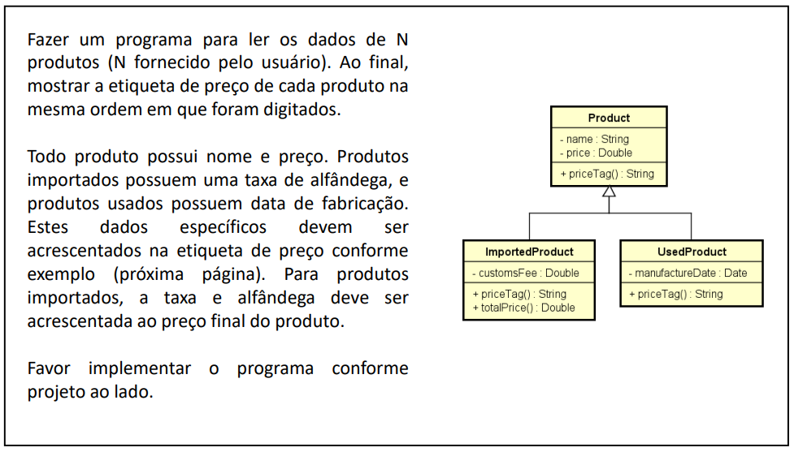
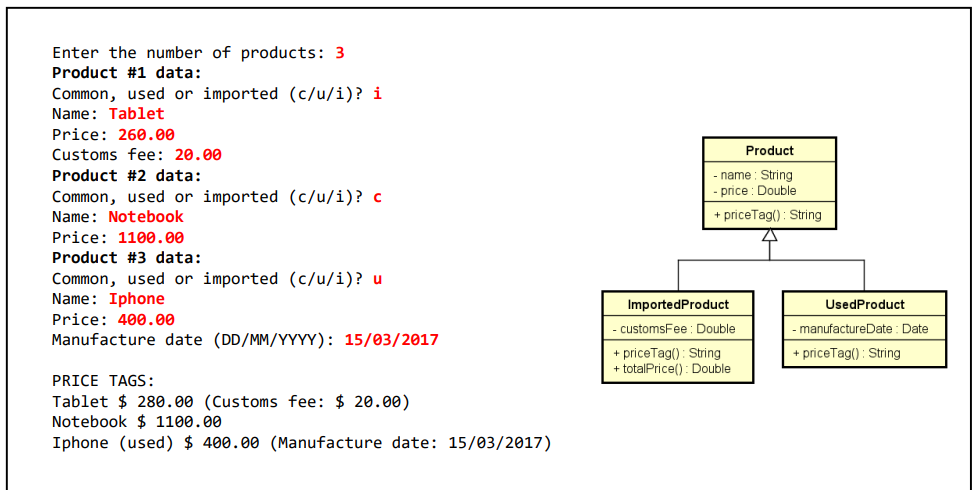
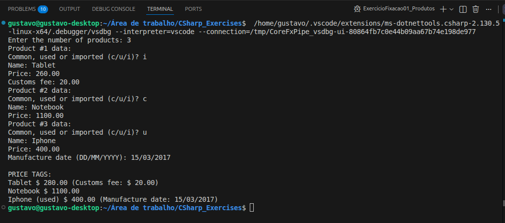
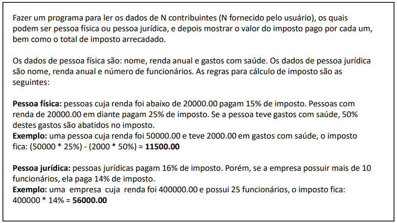
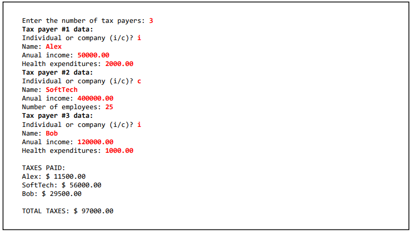
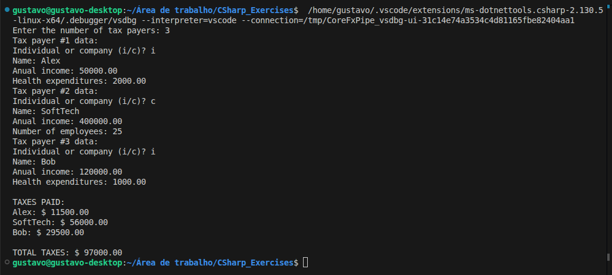

# Exercícios: Herança e Polimorfismo


Este diretório reúne as resoluções dos exercícios de fixação sobre herança e polimorfismo, do curso **[C# COMPLETO Programação Orientada a Objetos + Projetos](https://www.udemy.com/course/programacao-orientada-a-objetos-csharp/)**, ministrado pelo professor **Nelio Alves** na plataforma **Udemy**.

📌 **Foco:** aplicar herança para reaproveitar código entre classes relacionadas, e polimorfismo para tratar objetos de tipos diferentes de forma uniforme.  
📊 **Progresso:** ✅ 2/2 concluídos.

---

## 🛠️ Conhecimentos Desenvolvidos

Nessa etapa, comecei a trabalhar de verdade com a orientação a objetos, não só criar classes, mas fazer elas se relacionarem. Alguns pontos que trabalhei:

* **Herança:** criação de classes filhas que herdam atributos e comportamentos da classe pai, evitando repetição de código.
* **Construtores com `base`:** uso de `: base(...)` para reaproveitar a inicialização da classe pai no construtor da filha.
* **Polimorfismo com `virtual` e `override`:** sobrescrita de métodos para que cada subclasse tenha seu próprio comportamento, mesmo sendo chamada pelo tipo da classe pai.
* **Classes abstratas:** uso de `abstract` para forçar que subclasses implementem determinados métodos, sem deixar instanciar a classe base diretamente.
* **Listas polimórficas:** armazenamento de objetos de tipos diferentes numa `List<ClassePai>`, iterando sobre todos com o comportamento correto de cada um.

---

## 📋 Resumo dos Exercícios

| \# | O que era pra fazer | O que eu pratiquei |
|---|---|---|
| **Ex 01** | Cadastro de produtos comuns, usados e importados com etiquetas de preço diferentes | Herança, `virtual`/`override`, lista polimórfica |
| **Ex 02** | Cálculo de imposto para pessoas físicas e jurídicas | Classe abstrata, `abstract`/`override`, polimorfismo |

---

## 💻 Soluções e Códigos

*(Clique nos títulos abaixo para exibir o enunciado, o código-fonte e o resultado no terminal)*

<details>
<summary><strong>Exercício 01: Produtos</strong></summary><br>

### 📷 Enunciado:



### 💻 Código:
```csharp
// Classe Product:
using System.Globalization;

namespace Entities
{
    class Product
    {
        public string Name { get; set; }
        public double Price { get; set; }

        public Product()
        {
        }

        public Product(string name, double price)
        {
            Name = name;
            Price = price;
        }

        public virtual string PriceTag()
        {
            return Name
                + " $ "
                + Price.ToString("F2", CultureInfo.InvariantCulture);
        }
    }
}

// Classe ImportedProduct:
using System.Globalization;

namespace Entities
{
    class ImportedProduct : Product
    {
        public double CustomsFee { get; set; }

        public ImportedProduct()
        {
        }

        public ImportedProduct(string name, double price, double customsFee)
            : base(name, price)
        {
            CustomsFee = customsFee;
        }

        public double TotalPrice()
        {
            return Price + CustomsFee;
        }

        public override string PriceTag()
        {
            return Name
                + " $ "
                + TotalPrice().ToString("F2", CultureInfo.InvariantCulture)
                + " (Customs fee: $ "
                + CustomsFee.ToString("F2", CultureInfo.InvariantCulture)
                + ")";
        }
    }
}

// Classe UsedProduct:
using System;
using System.Globalization;

namespace Entities
{
    class UsedProduct : Product
    {
        public DateTime ManufactureDate { get; set; }

        public UsedProduct()
        {
        }

        public UsedProduct(string name, double price, DateTime manufactureDate)
            : base(name, price)
        {
            ManufactureDate = manufactureDate;
        }

        public override string PriceTag()
        {
            return Name
                + " (used) $ "
                + Price.ToString("F2", CultureInfo.InvariantCulture)
                + " (Manufacture date: "
                + ManufactureDate.ToString("dd/MM/yyyy")
                + ")";
        }
    }
}

// Classe Program:
using System;
using System.Collections.Generic;
using System.Globalization;
using Entities;

namespace ExercicioFixacao01_Produtos
{
    class Program
    {
        static void Main(string[] args)
        {
            List<Product> list = new List<Product>();

            Console.Write("Enter the number of products: ");
            int n = int.Parse(Console.ReadLine());

            for (int i = 1; i <= n; i++)
            {
                Console.WriteLine("Product #" + i + " data:");
                Console.Write("Common, used or imported (c/u/i)? ");
                char type = char.Parse(Console.ReadLine());
                Console.Write("Name: ");
                String name = Console.ReadLine();
                Console.Write("Price: ");
                double price = double.Parse(Console.ReadLine(), CultureInfo.InvariantCulture);

                if (type == 'c')
                {
                    list.Add(new Product(name, price));
                }
                else if (type == 'u')
                {
                    Console.Write("Manufacture date (DD/MM/YYYY): ");
                    DateTime date = DateTime.Parse(Console.ReadLine());
                    list.Add(new UsedProduct(name, price, date));
                }
                else
                {
                    Console.Write("Customs fee: ");
                    double customsFee = double.Parse(Console.ReadLine(), CultureInfo.InvariantCulture);
                    list.Add(new ImportedProduct(name, price, customsFee));
                }
            }

            Console.WriteLine();
            Console.WriteLine("PRICE TAGS:");
            foreach (Product prod in list)
            {
                Console.WriteLine(prod.PriceTag());
            }
        }
    }
}
```

### 🖥️ Saída no Terminal:


</details>

---

<details>
<summary><strong>Exercício 02: Impostos</strong></summary><br>

### 📷 Enunciado:



### 💻 Código:
```csharp
// Classe TaxPayer (abstrata):
namespace Entities
{
    abstract class TaxPayer
    {
        public string Name { get; set; }
        public double AnualIncome { get; set; }

        public TaxPayer()
        {
        }

        protected TaxPayer(string name, double anualIncome)
        {
            Name = name;
            AnualIncome = anualIncome;
        }

        public abstract double Tax();
    }
}

// Classe Individual:
namespace Entities
{
    class Individual : TaxPayer
    {
        public double HealthExpenditures { get; set; }

        public Individual()
        {
        }

        public Individual(string name, double anualIncome, double healthExpenditures)
            : base(name, anualIncome)
        {
            HealthExpenditures = healthExpenditures;
        }

        public override double Tax()
        {
            if (AnualIncome < 20000.0)
            {
                return AnualIncome * 0.15 - HealthExpenditures * 0.5;
            }
            else
            {
                return AnualIncome * 0.25 - HealthExpenditures * 0.5;
            }
        }
    }
}

// Classe Company:
namespace Entities
{
    class Company : TaxPayer
    {
        public int NumberOfEmployees { get; set; }

        public Company()
        {
        }

        public Company(string name, double anualIncome, int numberOfEmployees)
            : base(name, anualIncome)
        {
            NumberOfEmployees = numberOfEmployees;
        }

        public override double Tax()
        {
            if (NumberOfEmployees > 10)
            {
                return AnualIncome * 0.14;
            }
            else
            {
                return AnualIncome * 0.16;
            }
        }
    }
}

// Classe Program:
using System;
using System.Collections.Generic;
using System.Globalization;
using Entities;

namespace ExercicioFixacao02_Impostos
{
    class Program
    {
        static void Main(string[] args)
        {
            List<TaxPayer> list = new List<TaxPayer>();

            Console.Write("Enter the number of tax payers: ");
            int n = int.Parse(Console.ReadLine());

            for (int i = 1; i <= n; i++)
            {
                Console.WriteLine($"Tax payer #{i} data:");
                Console.Write("Individual or company (i/c)? ");
                char type = char.Parse(Console.ReadLine());
                Console.Write("Name: ");
                String name = Console.ReadLine();
                Console.Write("Anual income: ");
                double income = double.Parse(Console.ReadLine(), CultureInfo.InvariantCulture);

                if (type == 'i')
                {
                    Console.Write("Health expenditures: ");
                    double healthExpenditures = double.Parse(Console.ReadLine(), CultureInfo.InvariantCulture);
                    list.Add(new Individual(name, income, healthExpenditures));
                }
                else
                {
                    Console.Write("Number of employees: ");
                    int numberOfEmployees = int.Parse(Console.ReadLine());
                    list.Add(new Company(name, income, numberOfEmployees));
                }
            }

            double sum = 0.0;
            Console.WriteLine();
            Console.WriteLine("TAXES PAID:");
            foreach (TaxPayer tp in list)
            {
                double tax = tp.Tax();
                Console.WriteLine(tp.Name + ": $ " + tax.ToString("F2", CultureInfo.InvariantCulture));
                sum += tax;
            }

            Console.WriteLine();
            Console.WriteLine("TOTAL TAXES: $ " + sum.ToString("F2", CultureInfo.InvariantCulture));
        }
    }
}
```

### 🖥️ Saída no Terminal:


</details>

---