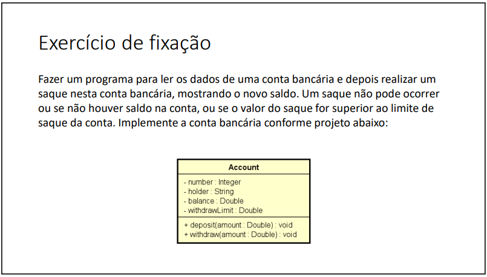
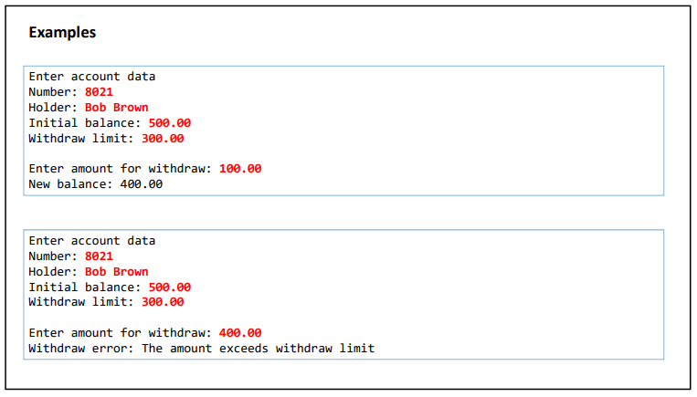
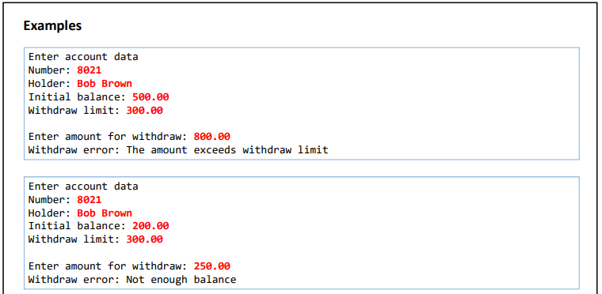
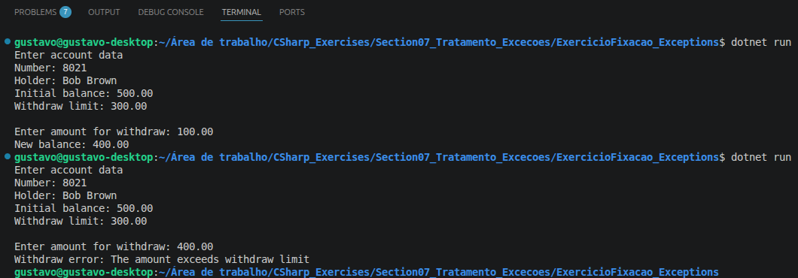
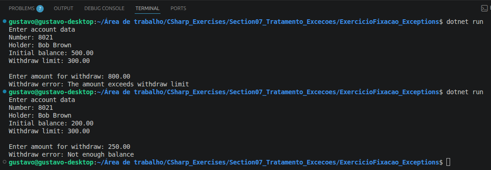

# Exercício: Tratamento de Exceções


Esse diretório reúne a resolução do exercício de fixação sobre tratamento de exceções, do curso **[C# COMPLETO Programação Orientada a Objetos + Projetos](https://www.udemy.com/course/programacao-orientada-a-objetos-csharp/)**, ministrado pelo professor **Nelio Alves** na plataforma **Udemy**.

📌 **Foco:** tratar erros usando exceções personalizadas e deixar as validações dentro da própria classe, em vez de espalhar `if` pelo programa.  
📊 **Progresso:** ✅ 1/1 concluído.

---

## 🛠️ Conhecimentos Desenvolvidos

Nessa etapa, pratiquei como tratar erros sem complicar o código. Em vez de vários `if` espalhados, usei exceções pra deixar tudo mais organizado. Principais pontos:

* **`try-catch`:** separar o que é execução normal do tratamento de erro.
* **`throw`:** lançar exceções quando alguma regra é quebrada.
* **Exceções personalizadas:** criei a `DomainException` pra tratar erros de regra de negócio.
* **Validações na classe:** a lógica ficou dentro da `Account`, não no `Program`.
* **Hierarquia de exceções:** entendi melhor a diferença entre exceções da aplicação e do sistema.

---

## 📋 Resumo dos Exercícios

| \# | O que era pra fazer | O que eu pratiquei |
|---|---|---|
| **Ex 01** | Conta bancária com saque validado por saldo e limite | `try-catch`, `throw`, exceção personalizada com `DomainException` |

---

## 💻 Soluções e Códigos

*(Clique nos títulos abaixo para exibir o enunciado, o código-fonte e o resultado no terminal)*

<details>
<summary><strong>Exercício 01: Conta Bancária</strong></summary><br>

### 📷 Enunciado e exemplos:




### 💻 Código:
```csharp
// Classe DomainException:
using System;

namespace Entities.Exceptions
{
    class DomainException : ApplicationException
    {
        public DomainException(string message) : base(message)
        {
        }
    }
}

// Classe Account:
using Entities.Exceptions;

namespace Entities
{
    class Account
    {
        public int Number { get; set; }
        public string Holder { get; set; }
        public double Balance { get; set; }
        public double WithdrawLimit { get; set; }

        public Account()
        {
        }

        public Account(int number, string holder, double balance, double withdrawLimit)
        {
            Number = number;
            Holder = holder;
            Balance = balance;
            WithdrawLimit = withdrawLimit;
        }

        public void Deposit(double amount)
        {
            Balance += amount;
        }

        public void Withdraw(double amount)
        {
            if (amount > WithdrawLimit)
            {
                throw new DomainException("The amount exceeds withdraw limit");
            }
            if (amount > Balance)
            {
                throw new DomainException("Not enough balance");
            }

            Balance -= amount;
        }
    }
}

// Classe Program:
using System;
using System.Globalization;
using Entities;
using Entities.Exceptions;

public class ProcessFile
{
    public static void Main()
    {
        Console.WriteLine("Enter account data");
        Console.Write("Number: ");
        int number = int.Parse(Console.ReadLine());
        Console.Write("Holder: ");
        String holder = Console.ReadLine();
        Console.Write("Initial balance: ");
        double balance = double.Parse(Console.ReadLine(), CultureInfo.InvariantCulture);
        Console.Write("Withdraw limit: ");
        double withdrawLimit = double.Parse(Console.ReadLine(), CultureInfo.InvariantCulture);

        Account acc = new Account(number, holder, balance, withdrawLimit);

        Console.WriteLine();
        Console.Write("Enter amount for withdraw: ");
        double amount = double.Parse(Console.ReadLine(), CultureInfo.InvariantCulture);
        try
        {
            acc.Withdraw(amount);
            Console.WriteLine("New balance: " + acc.Balance.ToString("F2", CultureInfo.InvariantCulture));
        }
        catch (DomainException e)
        {
            Console.WriteLine("Withdraw error: " + e.Message);
        }
    }
}
```

### 🖥️ Saídas no terminal:



</details>

---